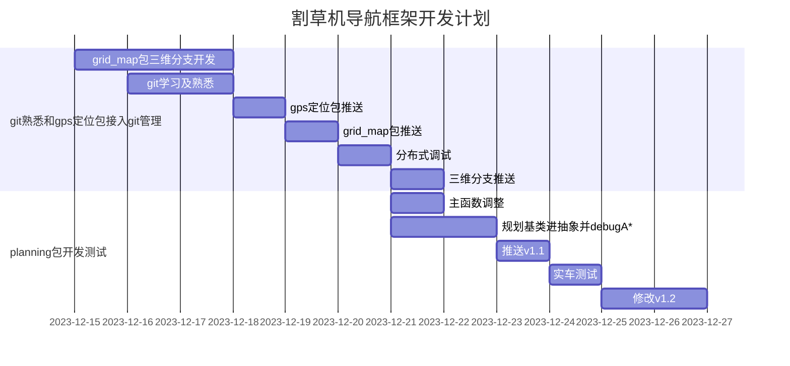

```mermaid
gantt
	title  割草机导航框架开发计划
	section git熟悉和gps定位包接入git管理
		grid_map包三维分支开发 :2023-12-15,3d
		git学习及熟悉 :2023-12-16,2d
		gps定位包推送 :1d
		grid_map包推送 :1d
		分布式调试 :a1,2023-12-20,1d
		三维分支推送 :1d
	section planning包开发测试
		主函数调整 :after a1,1d
		规划基类进抽象并debugA* :after a1,2d
		推送v1.1 :1d
		实车测试 :1d
		修改v1.2 :2d
		
	
```
