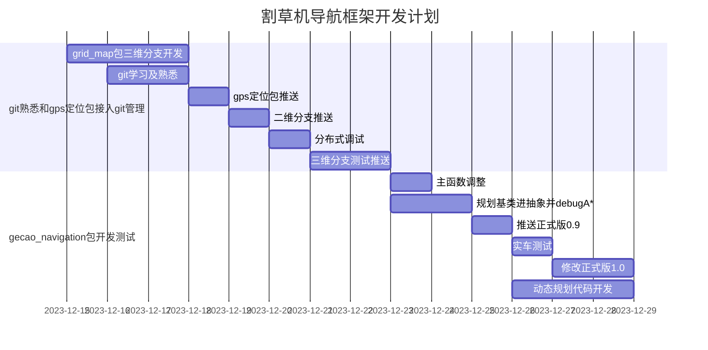

---
- [x] 推送gps_localization
- [x] 推送grid_map的2d分支
- [x] 开发grid_map的3d分支
- [x] 分布式调试
- [x] 推送grid_map的3d分支
- [ ] decider主函数调整
- [ ] debug A\*
- [ ] 规划基类抽象
- [ ] 推送gecao_navigation的正式版0.9分支
- [ ] 实车测试并修改正式版0.9分支
- [ ] 离线修改并推送正式版1.0分支
- [ ] 实车测试并合并分支
